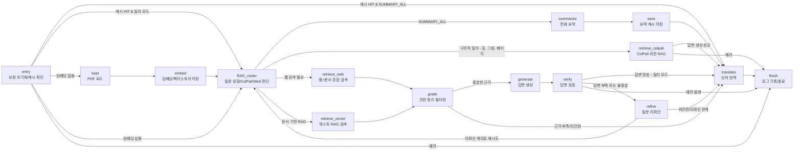
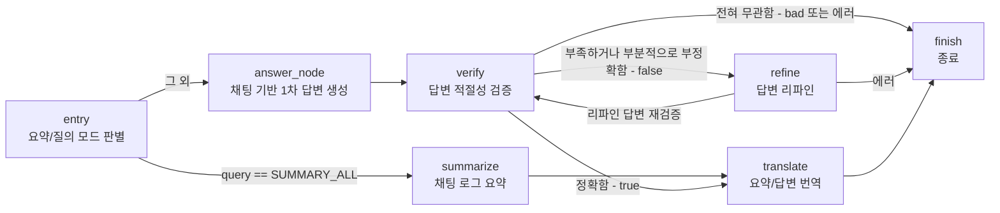
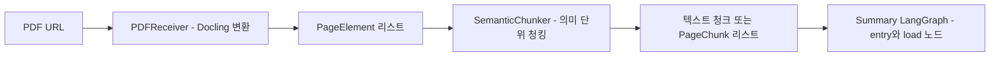
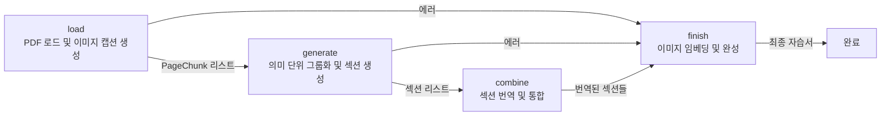

# UCWARE LLM API  
___
UCWARE LLM API는 PDF 문서 및 채팅 기록에 대한 요약 및 질의응답 기능을 제공하는 서비스입니다.

## I. Features
___
- PDF 문서 / 채팅 기록 요약: PDF 문서 및 채팅 데이터를 업로드하면 핵심 내용을 자동으로 요약하여 제공합니다.
- 사용자 질의응답: 문서나 대화 기록을 바탕으로 한 Q&A 기능을 제공합니다. Tavily API Key가 제공될 경우 웹 검색 또한 가능합니다.
- 멀티모달 PDF 자습서 생성: PDF 문서의 텍스트와 이미지를 활용하여 학습자 친화적인 자습서를 자동으로 생성합니다. 이미지 캡션 생성 및 의미 단위 그룹화를 통해 체계적인 학습 가이드를 제공합니다.
- 캐싱 및 재사용: 동일한 파일에 대한 반복 요청 시 결과를 Redis 캐시에서 즉시 반환하여 응답 속도를 높입니다. 벡터 임베딩도 최초 1회 생성 후 DB에 저장되므로 이후부터 빠르게 검색합니다.  
- 피드백 수집: 사용자로부터 요약/답변에 대한 평점(1~5)과 의견을 받아 품질 향상에 활용할 수 있습니다.

## II. Setup
___
### 0. Requirements
- 이 서비스를 이용하기 위해서 아래와 같은 환경이 요구됩니다: 
	- OpenAI API Token (OpenAI LLM 이용시)
	- Tavily API Key (Web Search 이용시)
	- HuggingFace Hub Token (vLLM 이용시)

### 1. 의존성 설치 및 가상환경 구성
```bash
bash setup_env.sh
```
   - 서비스 사용을 위한 사전 환경 설정을 진행합니다.
   - 수행 기능 목록:
	   - 시스템 패키지 및 requirements.txt 기반 pip 패키지 설치
	   - llm 제공자 선택(OpenAI, HuggingFace)
	   - 서비스 사용에 필요한 환경 변수 설정(`OPENAI_API_KEY`, `TAVILY_API_KEY`를 받아옴. 다른 환경 변수들은 쉘파일 내 하드코딩되어있으므로 유동적으로 변경.)
	   - 환경변수를 저장해둘 `.env` 파일 자동 생성

### 2. (선택) 로컬 LLM 서버 실행

```bash
bash run_vllm.sh
```

   - vllm을 이용해 llm 모델을 서빙합니다. `1. 의존성 설치 및 가상환경 구성` 에서 llm 제공자를 OpenAI로 선택했다면 이 단계는 생략합니다.
   - `HUGGING_FACE_HUB_TOKEN`을 입력받습니다. 필요하지 않은 경우 공란으로 넘어갑니다.
   - 기본적으로 12000번 포트, `Qwen/Qwen3-30B-A3B-GPTQ-Int4` 모델을 이용하도록 설계되어있으며 유동적으로 변경이 가능합니다.
   - 아래 명령어를 이용해 서버를 종료할 수 있습니다
```bash
bash scripts/stop_vllm.sh   
```
  

### 3. 서비스 전체 실행

   ```bash
   bash run_all.sh
   ```

   - 서비스 시작을 위해 Redis, Chroma(DB), FastAPI 서버를 구동합니다.
   - 기본 포트는 아래와 같습니다.

|     서버     |        포트        |
| :--------: | :--------------: |
|   Redis    |       6379       |
| Chroma(DB) |       9000       |
|  FastAPI   | 사용자 입력(기본값 8000) |
- 아래 명령어로 서버를 종료할 수 있습니다.
```bash
bash scripts/stop_services.sh
```
## III. Usage
___

### 1. PDF 요약 및 질의 (POST `/api/summary`)
- `query`가 `SUMMARY_ALL` 인 경우 `summary` 필드에 전체 요약문을 출력합니다.
- `SUMMARY_ALL` 이외의 `query`인 경우 자체적으로 사용자의 질문이라 판단해 답변을 `answer` 필드에 출력합니다.

-  요청 바디 예문:
```json
{
  "file_id": "fid_abc123",
  "pdf_url": "https://example.com/sample.pdf",
  "query": "SUMMARY_ALL",
  "lang": "KO"
}
```

- 응답 바디 예문:
```json
{
  "file_id": "fid_abc123",
  "summary": "이 문서는 AI 기술에 관한 논문으로...",
  "cached": false,
  "log": ["load_pdf attempt 1 [120ms]", "..."]
}
```
### 2. 채팅 요약 및 질의 (POST `/api/chat-summary`)
- PDF Summary와 마찬가지로 `query`가 `SUMMARY_ALL` 인지 아닌지에 따라 요약, 또는 답변을 각각 `summary`, `answer` 필드에 출력합니다.
- 요청 바디로 `chats` , `query` , `lang`, 필드를 전달합니다.
- `chats`는 채팅 메시지 객체들의 배열이며, 각 객체는 `chat_id`, `plaintext` , `sender` , `timestamp` 필드를 포함해야 합니다.

- 요청 바디 예문:
```json
{
  "chats": [
    {
      "chat_id": "room1",
      "plaintext": "오늘 회의 시작하겠습니다.",
      "sender": "user1",
      "timestamp": "2025-07-28T09:00:00"
    }
  ],
  "query": "SUMMARY_ALL",
  "lang": "ko"
}
```

- 응답 바디 예문:
```json
{
  "summary": "오늘 회의에서는 프로젝트 일정에 대해 논의했습니다.",
  "log": ["summarize:1", "translate:1"]
}
```
### 3. 피드백 제출 (POST `/api/feedback`)
- 서비스에 대한 만족도 평가를 제출용 엔드포인트로, 의무적으로 사용할 필요는 없습니다.
  
- 요청 바디 예문:
```json
{
  "file_id": "fid_abc123",
  "pdf_url": "https://example.com/sample.pdf",
  "lang": "KO",
  "rating": 5,
  "comment": "정확하고 빠른 요약 감사합니다!",
  "usage_log": ["load_pdf:1", "summary:1"]
}
```

- 응답 바디 예문문:
```json
{
  "id": "fb_123e4567-e89b-12d3-a456-426614174000",
  "created_at": "2025-07-28T02:15:30.123456",
  "ok": true
}
```

### 4. 멀티모달 PDF 자습서 생성 (POST `/api/tutorial`)
- PDF 문서를 기반으로 이미지와 텍스트를 포함한 자습서를 자동 생성합니다.
- 생성된 자습서는 Markdown 형식으로 반환되며, 이미지는 base64 data-URI로 임베딩됩니다.
- 지원 언어: `ko` (한국어), `en` (영어), `ja` (일본어), `zh` (중국어)
- 요청 바디로 `file_id`, `pdf_url`, `lang` 필드를 전달합니다.

- 요청 바디 예문:
```json
{
  "file_id": "fid_abc123",
  "pdf_url": "https://example.com/sample.pdf",
  "lang": "ko"
}
```

- 응답 바디 예문:
```json
{
  "file_id": "fid_abc123",
  "tutorial": "# 자습서 가이드\n\n## 섹션 1\n\n이 섹션에서는...\n\n\n\n...",
  "cached": false,
  "log": ["load attempt 1 [250ms]", "generate attempt 1 [1200ms]", "combine attempt 1 [800ms]"]
}
```

## IV. Structure
___

- 서비스의 전반적이 구조는 아래와 같습니다.
```
.
├── run_all.sh, run_vllm.sh       # 실행 스크립트
├── setup_env.sh                  # 환경 변수 설정
├── scripts/                      # 실행/종료 스크립트 모음
└── app/                          # 애플리케이션 루트
    ├── controller/               # HTTP 요청 라우팅 및 엔드포인트 핸들러
    ├── dto/                      # 요청/응답용 데이터 클래스
    ├── service/                  # LangGraph 기반 서비스 로직
    ├── domain/                   # 인터페이스 정의
    ├── infra/                    # 인터페이스 구현체
    ├── cache/, vectordb/         # 저장 계층
    │
    ├── main.py                   # FastAPI 진입점
    └── prompts.py                # 프롬프트 문자열 모음
```

## V. LangGraph 파이프라인 - ColPali 및 Docling
___

- PDF 요약과 질의 파이프라인은 `app/service/summary_graph_builder.py` 에 정의된 **LangGraph 기반 상태 머신**으로 동작합니다.
- `RAG_router` 노드에서 사용자의 질의 유형을 판별하여, 아래 3가지 경로 중 하나로 분기합니다.
  - **텍스트 RAG 경로** - 문서 벡터 검색용 노드 `retrieve_vector`
  - **웹과 문서 하이브리드 경로** - 웹 검색과 문서 RAG를 함께 사용하는 노드 `retrieve_web`
  - **구조적 질의 경로 - 그림, 표, 페이지 등** - ColPali 비전 RAG 노드 `retrieve_colpali`

### 1. PDF 요약과 질의 LangGraph 구조

아래는 PDF 요약과 질의에 사용되는 LangGraph의 주요 노드와 분기 구조입니다.



### 2. 채팅 요약과 질의 LangGraph 구조

- 채팅 로그 기반 요약/질의 파이프라인은 `app/service/chat_graph_builder.py` 의 `ChatGraphBuilder` 로 정의되며, `chat_summary_graph.py` 를 통해 FastAPI에서 사용됩니다.



### 3. Docling 기반 PDF 전처리 파이프라인

- PDF 콘텐츠는 LangGraph에 들어오기 전에 `app/infra/pdf_receiver.py` 와 `app/infra/semantic_chunker.py` 를 통해 Docling 기반 전처리를 거칩니다.
- 전체 흐름은 아래와 같습니다.
  - PDF URL 입력
  - `PDFReceiver` 가 Docling을 사용해 텍스트와 그림 정보를 가진 `PageElement` 리스트로 변환
  - `SemanticChunker` 가 `PageElement` 리스트를 의미 단위 청크로 묶어서 텍스트 청크 또는 `PageChunk` 리스트로 변환
  - `PdfLoader` 가 이 청크들을 LangGraph의 `load` 노드에서 사용할 수 있도록 반환



### 4. 멀티모달 PDF 자습서 생성 LangGraph 구조

- PDF 자습서 생성 파이프라인은 `app/service/guide_graph_builder.py` 의 `GuideGraphBuilder` 로 정의되며, `guide_service_graph.py` 를 통해 FastAPI에서 사용됩니다.
- PDF의 텍스트와 이미지를 함께 처리하여 학습자 친화적인 자습서를 생성합니다.
- 전체 흐름은 아래와 같습니다:
  - PDF 로드: Docling을 통해 텍스트와 이미지를 추출하고, VLM을 사용해 이미지 캡션 생성
  - 의미 단위 그룹화: 유사도 기반으로 청크들을 학습 단위로 그룹화
  - 섹션 생성: 각 그룹에 대해 병렬로 자습서 섹션 생성 (이미지 포함)
  - 번역 및 통합: 생성된 섹션들을 병렬로 번역하고 하나의 Markdown 문서로 통합
  - 이미지 임베딩: 이미지 ID를 base64 data-URI로 교체하여 최종 자습서 완성


